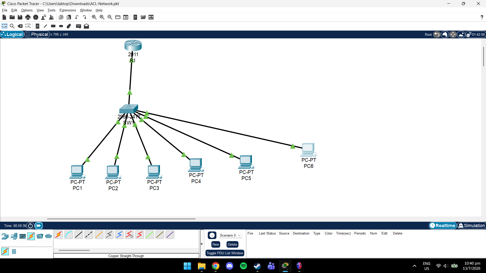
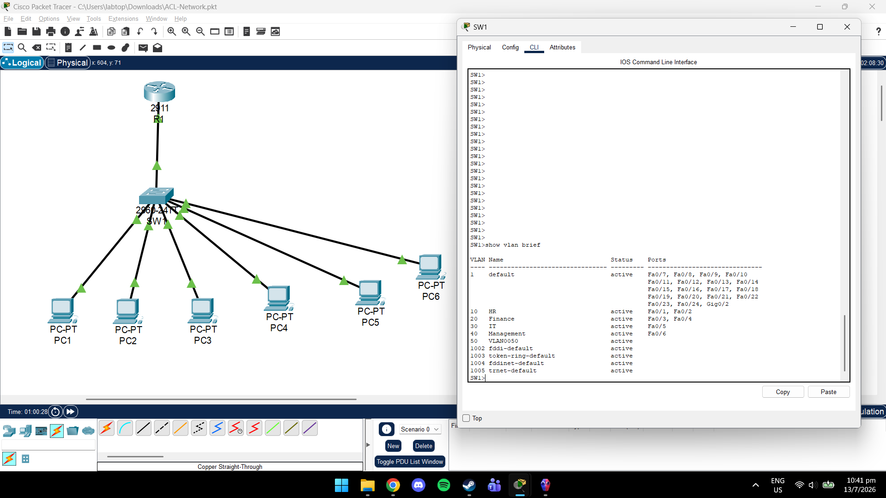
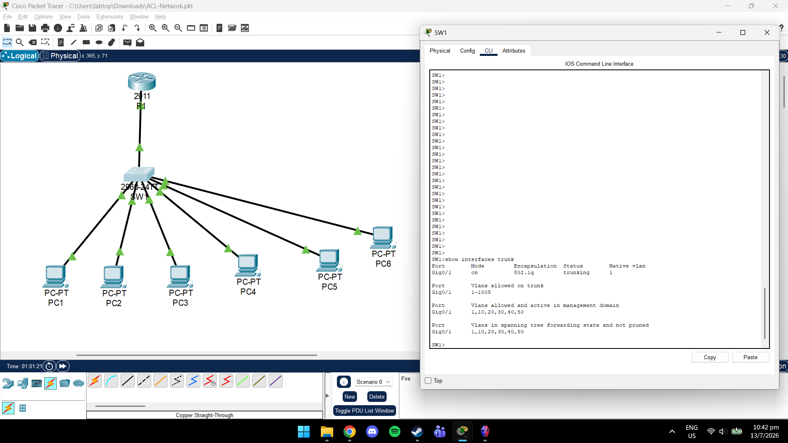
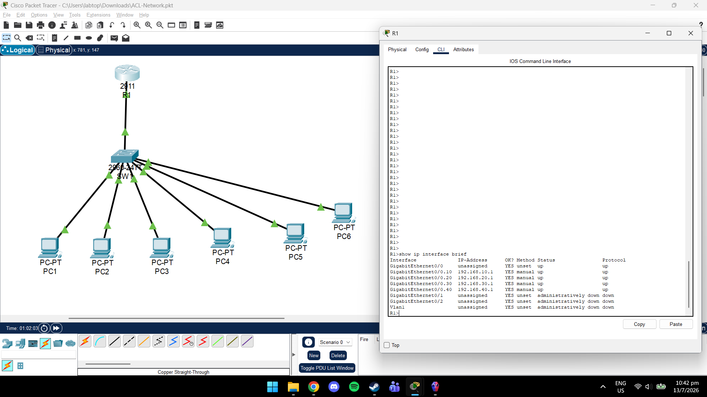
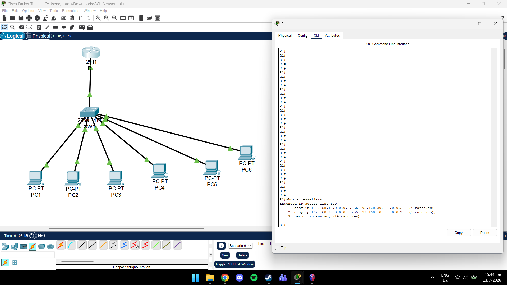
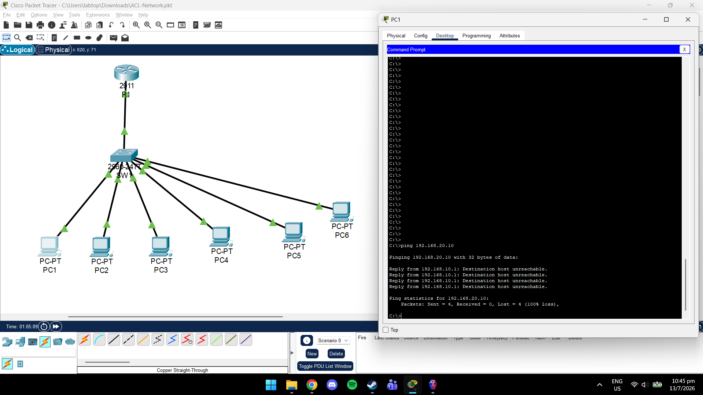
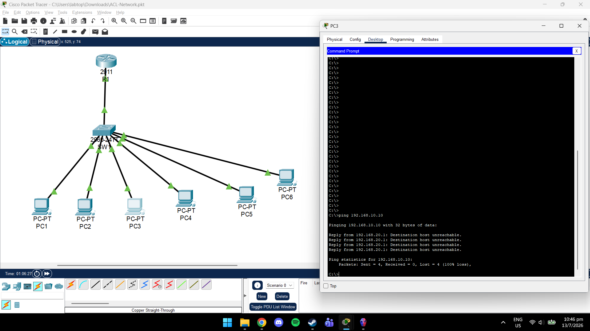
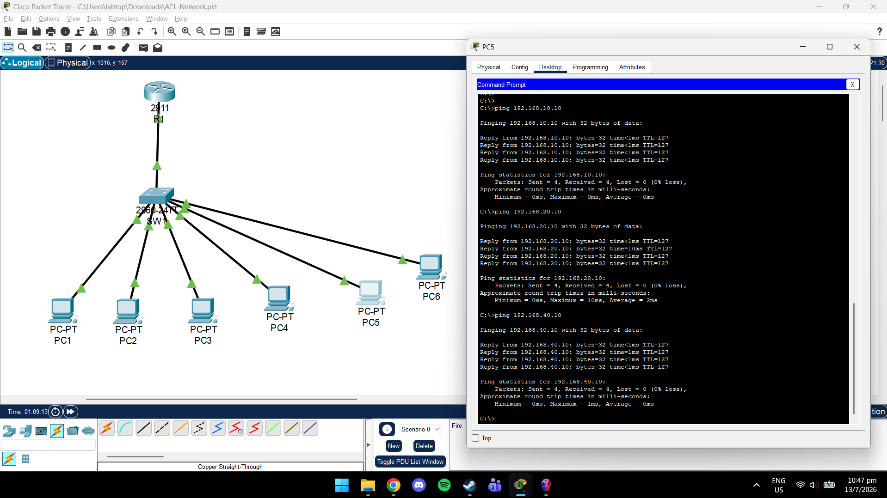
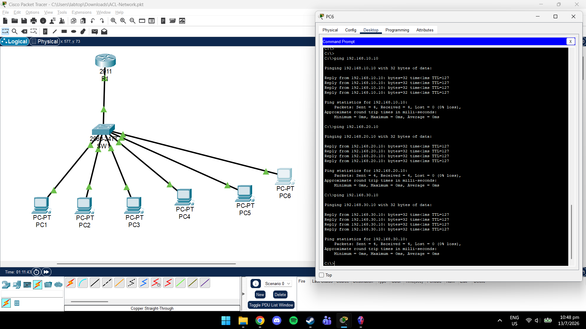

# Network Segmentation with Access Control Lists (ACLs)

## Overview

Continuing from my previous project, I decided to demonstrates how Access Control Lists (ACLs) can be used to enforce network security policies in a segmented enterprise network.

The network consists of four departments connected through VLANs. Inter-VLAN communication is provided using Router-on-a-Stick, while extended ACLs are configured to restrict communication between selected departments.

---

## Network Topology

```
                     R1
                      │
                 802.1Q Trunk
                      │
                     SW1
 ┌──────┬──────┬──────┬──────┬──────┬──────────┐
 │      │      │      │      │      │
PC1    PC2    PC3    PC4    PC5    PC6

HR      HR  Finance Finance   IT  Management
```

---

## Technologies Used

- Cisco Packet Tracer
- Cisco IOS CLI
- VLANs
- IEEE 802.1Q Trunking
- Router-on-a-Stick
- Extended Access Control Lists (ACLs)
- IPv4 Networking

---

## VLAN Configuration

| VLAN | Department | Network |
|------|------------|----------------|
|10|HR|192.168.10.0/24|
|20|Finance|192.168.20.0/24|
|30|IT|192.168.30.0/24|
|40|Management|192.168.40.0/24|

---

## Security Policy

| Source | Destination | Result |
|---------|-------------|--------|
|HR|Finance|Blocked|
|Finance|HR|Blocked|
|IT|All VLANs|Allowed|
|Management|All VLANs|Allowed|

---

## Skills Demonstrated

- VLAN Configuration
- Inter-VLAN Routing
- Router-on-a-Stick
- Extended ACL Configuration
- Network Segmentation
- Cisco IOS CLI
- IPv4 Addressing
- Network Security
- Troubleshooting

---

## Verification

- Created four VLANs.
- Configured switch access ports.
- Configured 802.1Q trunking.
- Configured router subinterfaces.
- Applied extended ACLs.
- Verified blocked communication between HR and Finance.
- Verified unrestricted communication for IT and Management.

---

## Screenshots

### Network Topology



### VLAN Configuration



### Trunk Port



### Router Subinterfaces



### ACL Rules



### HR to Finance Blocked



### Finance to HR Blocked



### IT Access



### Management Access


